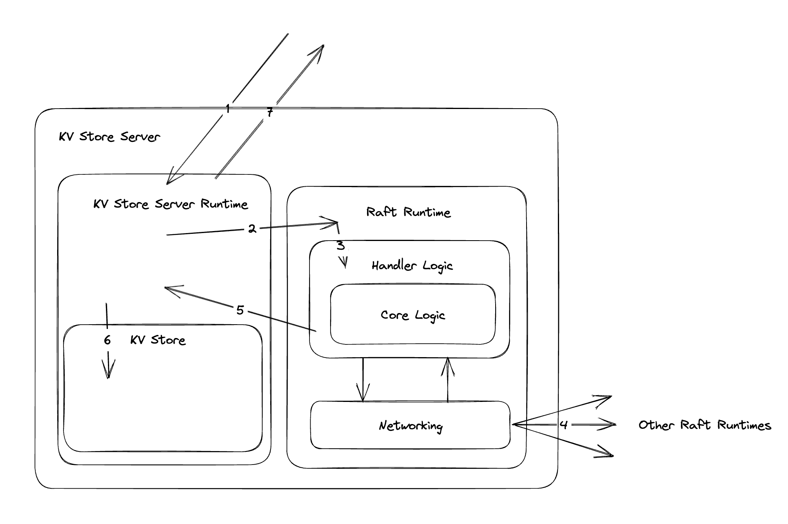

# Distributed KV Store

This repo features a toy distributed kv store with strongly consistent writes. Currently reads can be inconsistent during leader elections.

## Running
- This code requires python 3.6 to run
- Unit testing: ```python -m unittest```
- Run 5 kv store servers in seperate windows (replace n with 0-4): ```python kv_store_server.py n```
- Run kv store client ```python kv_store_client.py```

## Features
- Built from native python libraries, including the client, server, and networking components
- Concurrent server, however reaching consensus is sequential with only 1 dedicate thread per server
- Component separation and decoupling using queues
- Client round robin selects a kv server, however redirected on first request to leader
- Unit testing around raft logic, raft runtime, and kv store

## Todos
- To make reads linearizable, we need to implement a empty AppendEntries fan out with consensus on read
- Raft assumes the log is durable, however we use an in memory log with no compaction or rotation
- We do not support add/remove members to the cluster. Two phase configuration changes are described in the raft paper



## Request Path
1. Client request handled by KV Store Server
2. Raft runtime handles request to the Raft runtime module
3. Core logic module contains the most complicated raft logic
4. Networking module fans out necessary RPCs and collects responses
5. Handler logic detects consensus and passes request back to KV Store Server
6. Client request executed by our state machine
7. Response sent back to client

## Implementation Notes
- Raft is complicated to implement, however as decoupled approach where each component is isolated and unit tested makes the endeavor doable
- Raft <> kv store server integration is tricky as the interface is not entirely clean. Server must pass requests to raft, and the raft passing the commited request back to the server may be done on different threads. Keeping track of the connection and the back and forth requires unique ids to be encoded in the request and the raft log
- Raft is sensitive to latency. The heartbeat must not be affected by the rest of the system. Using concurrency features like seperate queues for i/o, worker pools for cpu based processing, and dedicated threads for election and heartbeats is essential to a well functioning cluster
- Any implementation is extremely hard to exhaustively test. This implementation is definately not production ready